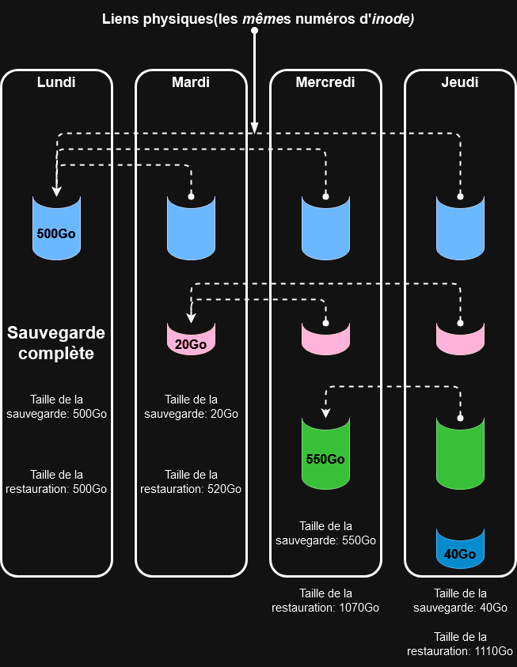

# Incremental_backup
Ce script est un outil de sauvegarde à utiliser pour sauvegarder des machines distantes.

Voici les différentes fonctions :
  * Sauvegarde de fichiers distants à l'aide de Rsync via SSH.
  * Sauvegarde de type incrémentielle.
  * Vérifie et attend que la machine soit connectée au réseau pour initier la sauvegarde.
  * Efface automatiquement les sauvegardes trop anciennes.
  * Création de logs.
  * Mise en place de notifications avec logger.



Après une sauvegarde complète, les sauvegardes suivantes sauvegarderont seulement les données modifiées ou ajoutées,
elles sont créées par le calcul des différences entre l’état du répertoire à sauvegarder de l’ordinateur distant et la dernière sauvegarde effectuée.

Les fichiers inchangés sont visibles dans chaque sauvegarde par des liens physiques et ceux qui ont été modifiés seront les seuls à occuper de l’espace sur le disque,
c'est l’option -–link-dest de la commande rsync qui est responsable de la création des liens physiques.

Les fichiers supprimés sur le répertoire distant n'apparaitront pas dans le dossier de sauvegarde.

## Exemple d'arborescence
```
daniel@tortue:~$ tree -L 3 .rsync_backups/
.rsync_backups/
└── PC_desktop
    ├── 2024-05-21_10-00-01
    │   ├── Applications
    │   ├── Documents
    │   ├── Music
    │   ├── Nextcloud
    │   └── Pictures
    └── logs
        └── 2024-05-21_10-00-01.log

9 directories, 1 file
```

## Configuration de cron
```
# m h  dom mon dow   command
00 18 * * * /home/daniel/incr_backup.sh
```
